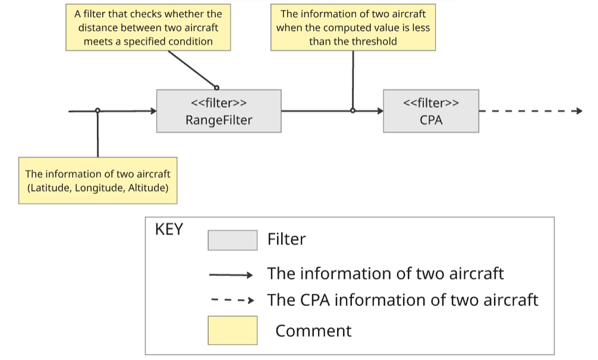
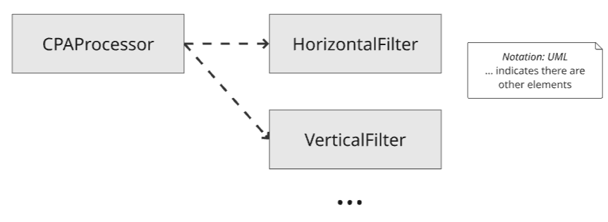
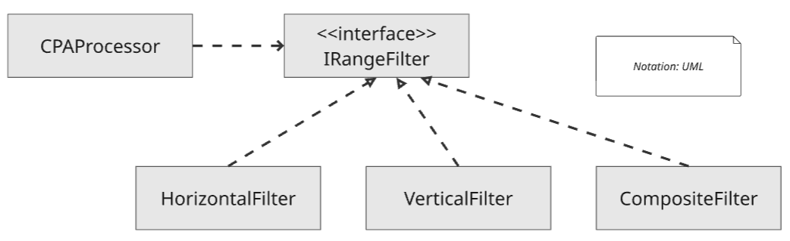

# ADR 004: Use Strategy Pattern for Efficient CPA Computation

우리는 시스템의 기능을 쉽게 확장할 수 있어야 한다는 요구사항을 받았습니다. 또한 우리는 Solvelt Inc 에 문의하여 CPA 기능 수행 관련 전체 지도(모든 항공기)를 수행하거나 일부 지역에 대해 수행하거나를 정의하라고 답변을 받았습니다. 우리는 Experiment 4를 통하여 모든 항공기에 대해서 CPA 기능을 수행하는 경우 상당한 시간이 소요됨을 확인하였습니다. 그래서 항공기의 현재 위치를 활용하여 충분이 멀리 떨어져 있어 CPA 연산이 필요하지 않은 항공기의 경우를 필터링했습니다. 필터 모듈을 설계하며 사용자가 필터의 종류 또는 쉽게 변경하거나 쉽게 추가할 수 있도록 설계할 필요가 있었습니다.
 
## Decision 

우리는 필터를 쉽게 변경 및 추가할 수 있도록 [Strategy Pattern](https://en.wikipedia.org/wiki/Strategy_pattern)을 사용할 것입니다.
인터페이스를 활용하여 추상화하고 클라이언트 코드는 해당 인터페이스에 Dependency를 갖고 Implement 코드는 Interface를 Realization하는 방법입니다. 사용자는 IRangeFilter 인터페이스를 구현함으로써 새로운 필터를 구현 및 적용할 수 있습니다.

## Rationale

모든 항공기에 대해서 충돌 위험성 평가 시 CPA 연산이 필요하지 않은 항공기에 대해서도 모두 계산하는 것은 효율적이지 못합니다. 이에 필터 설계가 필요했고 관련 내용을 Experiment4에 설명했습니다. 필터와 CPA 연산 모듈은 아래와 같은 구조로 설계 되어 있습니다.

case1) 필터 기능 구현에 strategy 패턴을 사용하지 않는 경우
- 패턴을 사용하지 않고 필터를 변경하거나 추가하는 경우 필터를 사용하는 클라이언트 코드가 여러 클래스에 의존성을 갖고 클라이언트 코드 수정이 많아질 수 있음

case2) 필터 기능 구현에 strategy 패턴을 사용하는 경우
- 필터를 사용하는 클라이언트 코드의 수정이 최소화 될 수 있으며 새로운 필터를 추가할 때 IRangeFilter 인터페이스에 구조를 맞추면 된다.

 
## Status
Proposed 

## Consequences
- 필터를 변경이 필요한 경우 클라이언트 코드 변경이 최소화 되었다.
- 필터 추가 시 IRangeFilter 인터페이스를 구현하면 추가가 가능하다.
- 
