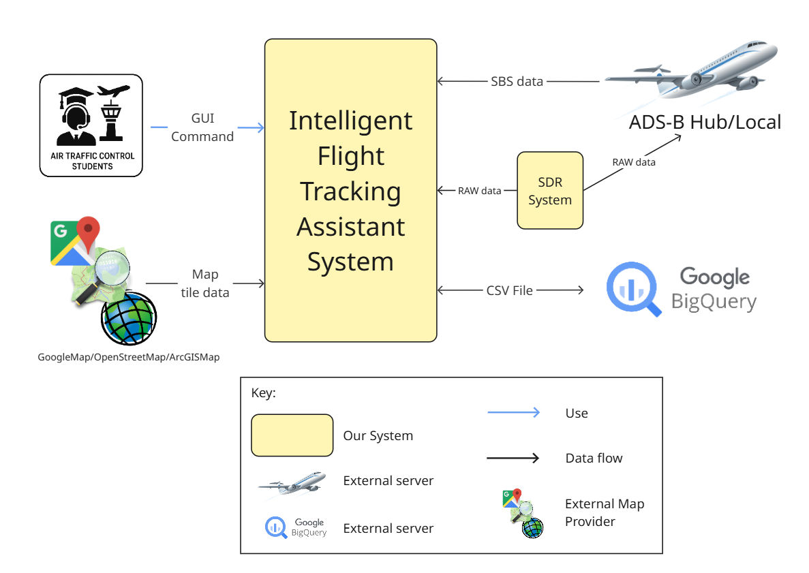
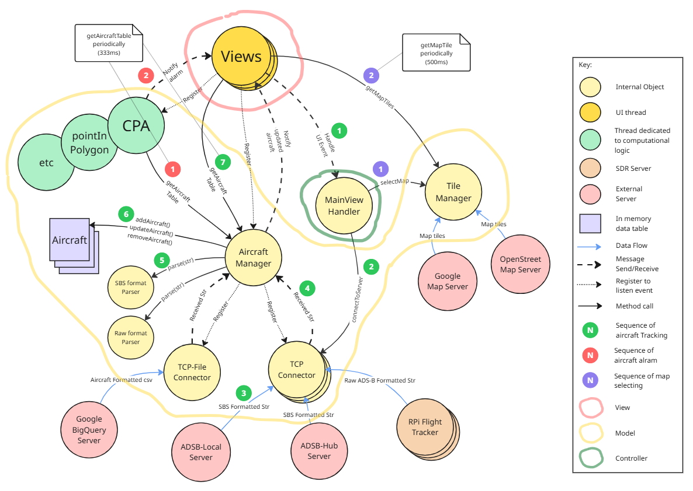
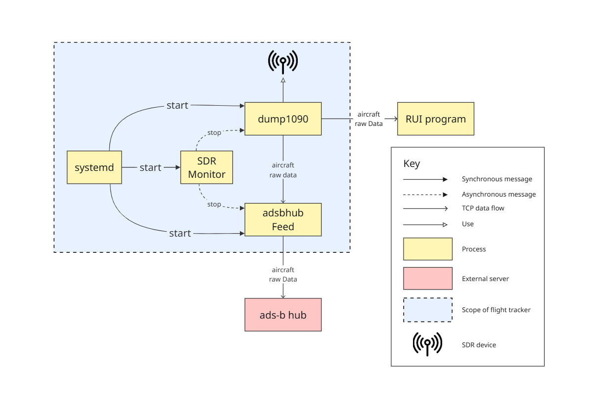
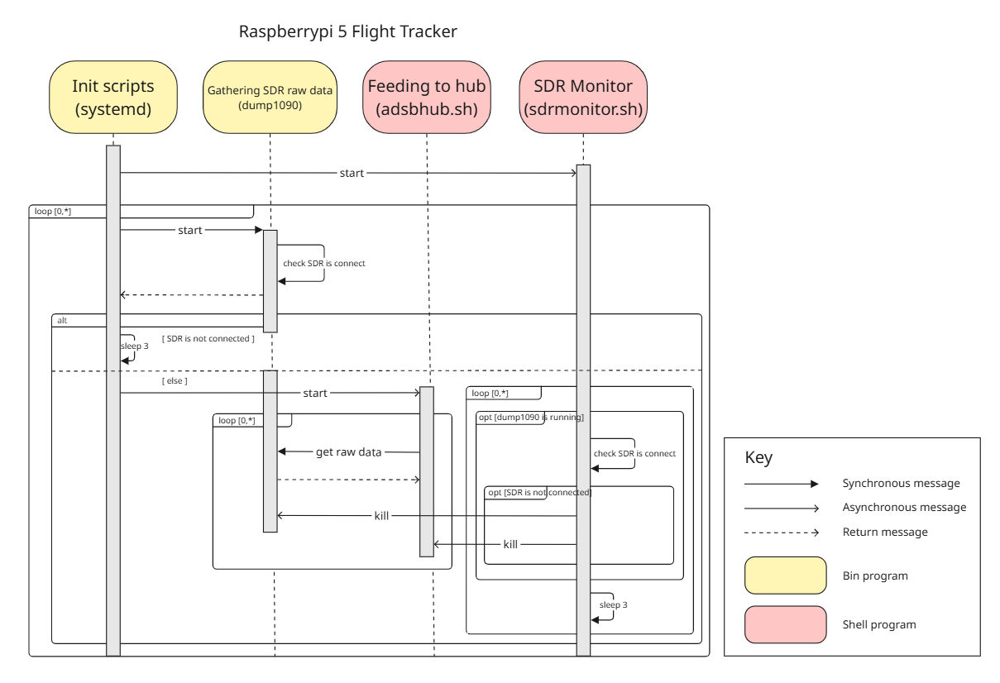

This is the GitHub repo for the solution created by team L5. It contains a proposed architecture for Intelligent Flight Tracking Assistant.

Team members:
- Sanghoon Roh <sanghoor@andrew.cmu.edu>
- Dongkyu Kim <dongkyu3@andrew.cmu.edu>
- Hanmin Jo <hanminj@andrew.cmu.edu>
- Ukheon Jeong <ujeong@andrew.cmu.edu>
- Kyungjik Min <kyungjim@andrew.cmu.edu>
- Hyunjae Im <hyunjaei@andrew.cmu.edu>

---

# Intelligent Flight Tracking Assistant

### Requirements

This section contains the requirements, distilled from the [provided document #1](https://canvas.cmu.edu/courses/47014/files/folder/Project?preview=12857641),
[provided document #2](https://canvas.cmu.edu/courses/47014/files/folder/Project?preview=12856383) and the interview with the SolveIt
but also with some assumptions we made. These requirements were the main drivers for the design decisions in this proposal.

- [Functional requirements](requirements/functional-rqmts.md)
- [Quality attribute requirements](requirements/quality-attribute-rqmts.md), aka architecture characteristics

### Architecture

Here you find the documentation of the software architecture that we envision to address Intelligent Flight Tracking Assistant's requirements. 

As a starting point, there's a context diagram that gives an overview of the external elements that interact with 
what we called the *Intelligent Flight Tracking Assistant*, which is the scope of this software architecture.

<table>
<tr><td align="center">Context Diagram 
</td></tr>
</table>

The main part of the software architecture is the set of five *architecture views* seen below. These views provide a runtime 
perspective of the system, that is, they show the components and connectors that have runtime presence and 
altogether correspond to the main capabilities provided by the Intelligent Flight Tracking Assistant system.

<table>
<tr>
    <td colspan="2" align="center">
        <a href="architecture/mvc-architecture-view.md">Aircraft Tracking - MVC architecture view 
        
        </a>
    </td>
</tr>
<tr>
    <td align="center"><a href="architecture/order-microservice-eda-view.md">Order - microservice and EDA view 
        </a>
    </td>
    <td align="center" valign="middle"><a href="architecture/customer-pickup-microservice-eda-view.md">Customer at pick-up location - microservice and EDA view 
        </a>
    </td>
</tr>
<tr>
    <td colspan="2" align="center">
        <a href="architecture/resilient-sdr-monitoring-and-recovery-view.md">SDR system (a.k.a Flight Tracker) - Resilient SDR monitoring and recovery view 
        
        </a>
    </td>
</tr>
</table>

Finally, we have a deployment view that describes Windows UI program(RUI) and Linux server program(Flight Tracker).    

<table>
<tr><td align="center"><a href="architecture/deployment-view.md">Deployment view 
</a></td></tr>
</table>

Our architecture views were documented following a lightweight [view template available here](https://github.com/pmerson/architecture-view-template). 
### ADRs

The linked ADRs below record the main architecture decisions regarding the proposed design, including their context and rationale.

- ADR 001 - [Use VBO method](ADRs/ADR001-maintain-multiple-copies-of-data.md)
- ADR 002 - [Use ping/Echo and retry tactic](ADRs/ADR002-ping-echo-retry.md)
- ADR 003 - [Use C#/WPF envinronment](ADRs/ADR003-use-cs.md)
- ADR 004 - [Use strategy pattern](ADRs/ADR004-strategy.md)
- ADR 005 - [Use polling-based monitoring](ADRs/ADR005-polling.md)

***Note***: we used [this ADR template](https://github.com/pmerson/ADR-template/blob/master/ADR-template.md).

--------------------------

### Backlog

--------------------------

## *About the team Name*

**Level5** represents the idea of a unified system formed by the collaboration of top experts across all domains.

