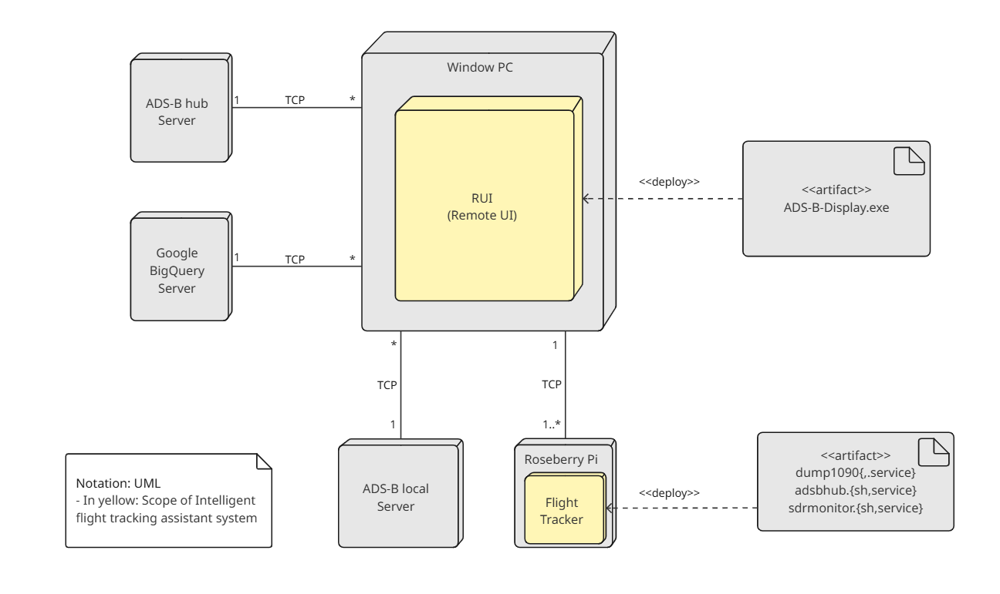

# Deployment View of the Intelligent Flight Tracking Assistant

This Deployment View describes how the Intelligent Flight Tracking Assistant system is physically deployed across various hardware nodes and external servers. The components within the yellow boxes represent the deployed scope of our system. The architecture uses a RUI client (Windows PC) and a distributed edge node (Raspberry Pi) to gather, process, and visualize ADS-B flight data.

## Element Catalog

#### Window PC
- Hosts the **RUI**, which provides graphical visualization and alarm display.
- Deploys the `ADS-B-Display.exe`.
- Connects to various servers (ADS-B, BigQuery, Raspberry Pi) via TCP.

#### RUI
- Core of the user interface and visualization logic.
- Pulls parsed aircraft data over TCP.
- Periodically renders views from cached data. (see [ADR-001](../ADRs/ADR001-maintain-multiple-copies-of-data.md))

#### Raspberry Pi (Flight Tracker)
- Edge device responsible for receiving raw ADS-B signals via SDR (Software Defined Radio).
- Deploys the following artifacts:
  - `dump1090{.service}`: Low-level SDR ADS-B decoder.
  - `adsbhub.{sh,service}`: Forwards data to hub/local servers.
  - `sdrmonitor.{sh,service}`: Monitors SDR hardware availability and restarts services if needed. (see [ADR-005](../ADRs/ADR005-polling.md))

#### ADS-B Hub/Local Server 
- Public or cloud-based server that aggregates and redistributes aircraft tracking feeds in SBS format.
- Communicates with RUI over TCP.

#### Google BigQuery Server
- Provides historical aircraft position datasets (e.g., CSVs).
- Queried on demand via TCP by RUI’s file connector module.

## Behavior
N/A

## Related ADRs
- ADR 001 - [Use VBO method](../ADRs/ADR001-maintain-multiple-copies-of-data.md)
- ADR 005 - [Use polling-based monitoring](../ADRs/ADR005-polling.md)

## Related Views
- [MVC Architecture View of the Intelligent Flight Tracking Assistant](./mvc-architecture-view.md)
- [Resilient SDR Monitoring and Recovery View](./resilient-sdr-monitoring-and-recovery-view.md)

