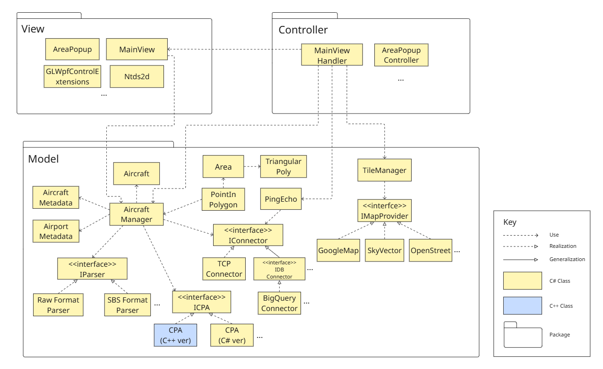

# MVC-based Class View of the Intelligent Flight Tracking Assistant

This architecture view provides a structural overview of a class-level design based on the Model-View-Controller (MVC) pattern. It illustrates the relationships among components responsible for rendering aircraft data, managing spatial and aircraft-related metadata, and supporting various map and connector integrations. The diagram helps identify how the system separates concerns between user interface rendering, data processing, and control logic. The use of interfaces significantly enhances `modifiability`, enabling the system to respond swiftly and flexibly to new or changing requirements.

## Element Catalog

Most of the classes correspond to the object names already defined and explained in the [C&C view](./mvc-architecture-cnc-view.md).
This section provides the catalog of additional classes.

### ***Model***

#### `PingEcho`
- Periodically attempt to reconnect when the ADS-B Hub or RPi Flight Tracker connection is lost.

#### `AircraftMetadata`
- Stores static metadata about aircraft.

#### `AirportMetadata`
- Stores static metadata about airports.

#### `TriangularPoly`
- A data structure that stores polygon shapes, typically used when users define custom areas on the map.

#### `Area`
- Represents a geographical region defined by the user.  
- Uses `TriangularPoly` for geometric definition.  
- Interacts with `AircraftManager` for region-based filtering or monitoring.

#### `IMAPProvider`
- Interface for different map providers.
- Realized by `GoogleMap`, `SkyVector`, and `OpenStreet`.
- Used by `TileManager` to manage map tile rendering.

#### `IConnector`
- Interface for network or database communication.
- Realized by `TCPConnector` and Generalized by `IDBConnector`, etc.
- Used by `PingEcho` for connectivity monitoring.  

#### `IDBConnector`
- Interface for external database communication.
- Realized by `BigQueryConnector`, etc.

#### `ICPA`
- Interface for performing analysis on aircraft data.
- Realized by classes like `CPA`.
  - CPA can be implemented in various languages such as C++ or C#, and is loaded as a DLL (runtime shared library).

#### `IParser`
- Interface for data parsers.
- Realized by `RawFormatParser`, `SBSFormatParser`, and other formats.

### ***View***

#### `GLWpfControlExtensions`
- Extensions that enable OpenGL rendering within a WPF (Windows Presentation Foundation) environment.

#### `AreaPopup`
- A popup window that appears after the user finishes drawing a polygon area on the map. It allows the user to input metadata such as the area name.

#### `Ntds2d`
- A module responsible for rendering aircraft and airport icons using OpenGL in a 2D context.

### ***Controller***

#### `AreaPopupController`
- The controller that manages logic related to the `AreaPopup`, such as capturing user input and updating the model accordingly.

## Behavior
N/A

## Related ADRs
- ADR 002 - [Use ping/echo tactic](../ADRs/ADR002-ping-echo.md)
- ADR 003 - [Use C#/WPF envinronment](../ADRs/ADR003-use-cs.md)
- ADR 004 - [Use filter pattern](../ADRs/ADR004-filter.md)

## Related Views
- [MVC architectue C&C view](./mvc-architecture-cnc-view.md)
