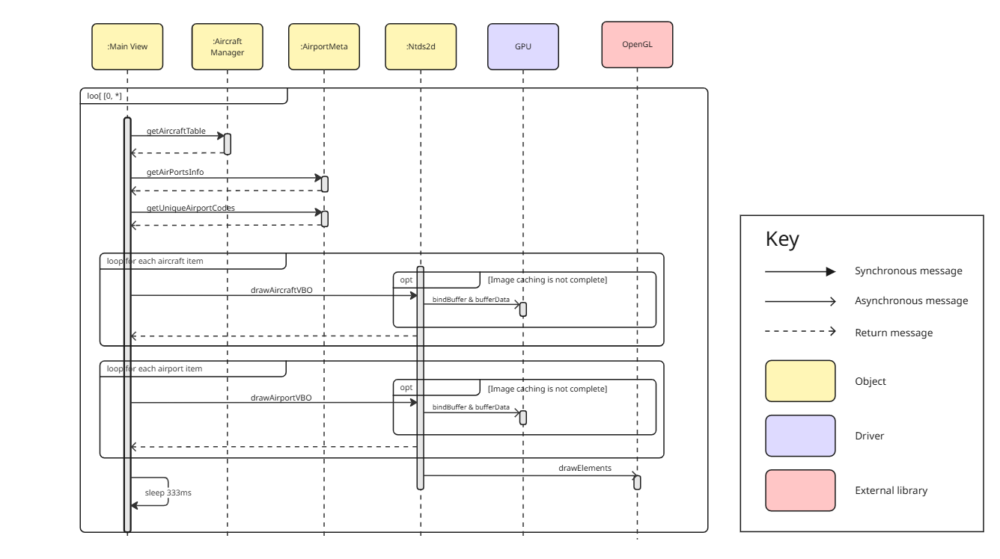
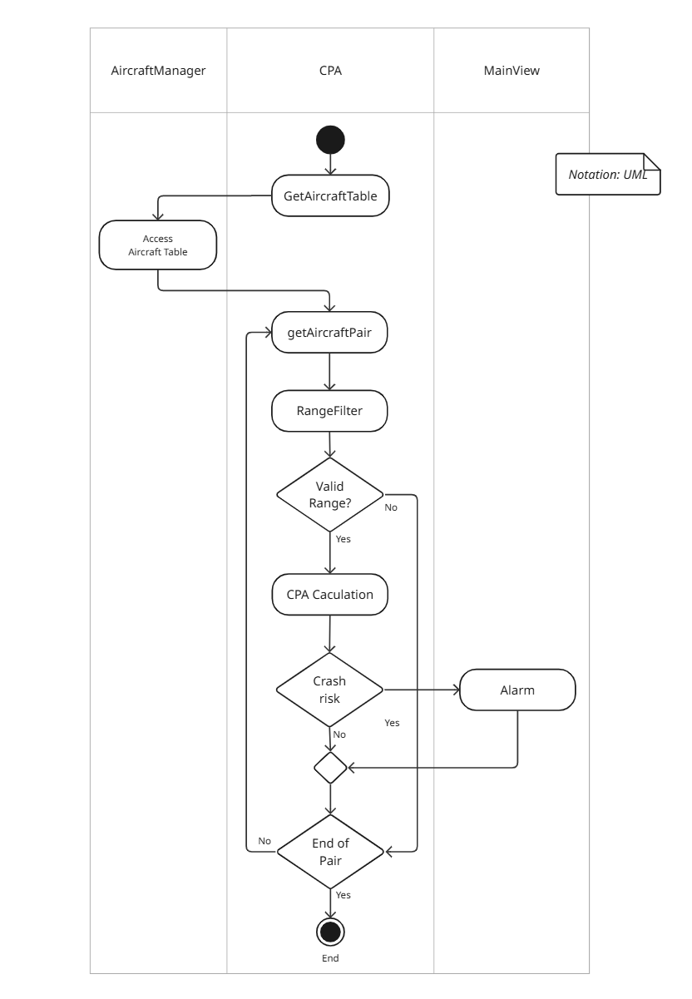

# MVC Architecture View of the Intelligent Flight Tracking Assistant

This architecture view describes how the Intelligent Flight Tracking Assistant system applies the Model-View-Controller (MVC) pattern to render aircraft and map information to users. It highlights the separation of concerns among internal components responsible for the data model, control logic, and user interface. The view illustrates how user interactions trigger updates to aircraft and map data and how these changes propagate through the system in real time.

## Element Catalog

#### Aircraft Manager- Receives SBS or raw aircraft data from connectors.
- Invokes the appropriate parser (e.g., SBS Format Parser or Raw Format Parser) based on the data format.
- Updates the internal aircraft table with the parsed result.
- Notifies listeners (e.g., Views) on every update.
  - Although `Views` can receive update notifications, actual rendering is triggered by the `Main View` itself periodically querying the aircraft table.
  - This design choice is driven by performance and UI responsiveness concerns. See [ADR-001](../ADRs/ADR001-maintain-multiple-copies-of-data.md) for details.

#### TCP Connector
- Connects to ADS-B data sources (e.g., RPi Flight Tracker, ADSB-Hub).
- Receives SBS-formatted or raw aircraft messages.
- Forwards data to aircraft manager.

#### TCP-File Connector
- Loads and parses historical aircraft data from sources such as BigQuery.
- Acts as a secondary input source for Aircraft Manager.

#### SBS Format Parser / Raw Format Parser
- Decodes incoming ADS-B strings into structured data.
- Supports multiple input formats for extensibility.

#### CPA / pointInPolygon / etc
- Computational threads that run background analysis (e.g., proximity, zone alerting).
- Periodically query Aircraft Manager and respond to changes (every 333ms).

#### Views
- UI components that display aircraft positions and alerts on screen.
- Periodically query Aircraft Manager and respond to changes (every 333ms).

#### MainView Handler
- Mediates user interaction (e.g., aircraft data source selection, map source selection).

#### Map Manager
- Requests and manages map tiles from external sources.
- Supplies updated visual maps to the View layer.

#### External Servers
- **Google Map Server / OpenStreetMap Server**: Provide background map imagery.
- **Google BigQuery Server**: Source of CSV aircraft data.
- **ADSB-Hub / ADSB-Local Server**: Live SBS aircraft feed.
- **RPi Flight Tracker**: Edge device that provides raw ADS-B messages.

## Behavior

### Sequence of Aircraft Tracking (Green #1-7 in diagram):
1. `User` click the connect button.
1. `MainView Handler` triggers connection via `TCP Connector`.
2. `TCP Connector` receives SBS messages.
3. `SBS messages` sent to `Aircraft Manager`.
3. `SBS Format Parser` decodes messages.
6. Aircraft table is updated.
7. `Views` query and display aircraft on screen. the rendering sequence is as follows:
  

### Sequence of Aircraft Alarm (Red #1-2):
- `CPA` monitors aircraft position changes.
- When criteria are met (e.g., collision risk), it sends alarm to `Views`. the CPA computation sequence is as follows:
  

### Sequence of Map Tile Updating (Purple #1-2):
- `User` select the map source in UI.
- `MainView Handler` selects map source.
- `Map Manager` retrieves tiles from external servers periodically (500ms).

## Related ADRs
- ADR 001 - [Use VBO method](../ADRs/ADR001-maintain-multiple-copies-of-data.md)
- ADR 003 - [Use C#/WPF envinronment](../ADRs/ADR003-use-cs.md)

## Related Views
N/A
